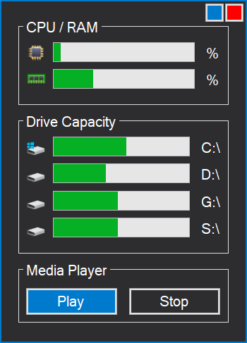

# Status
PC Status overview and media player (webradio) in one.

### Issues
The Visual Studio Designer sometimes won't load with x64 as target - to solve this, delete the obj and bin folders, then recompile the project with AnyCPU as target
